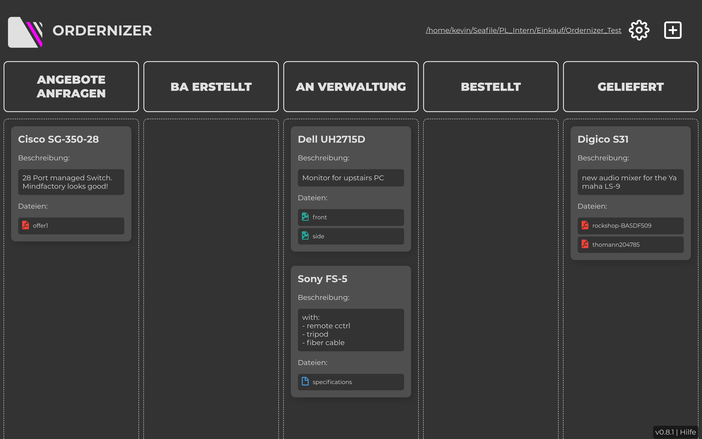
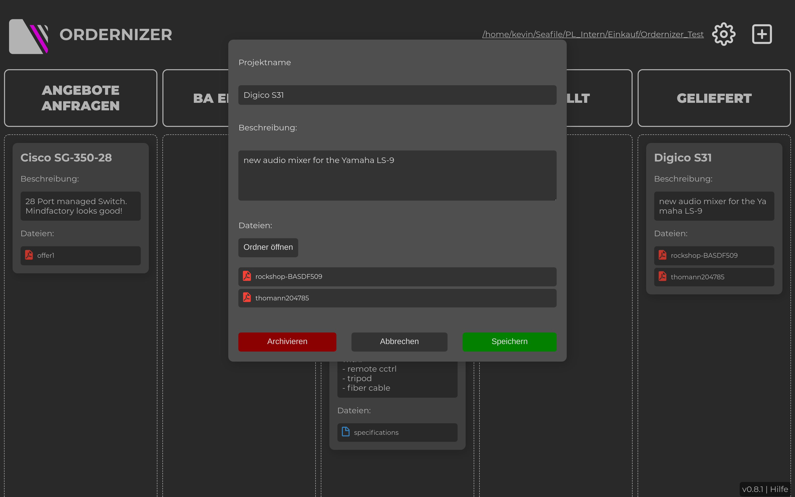
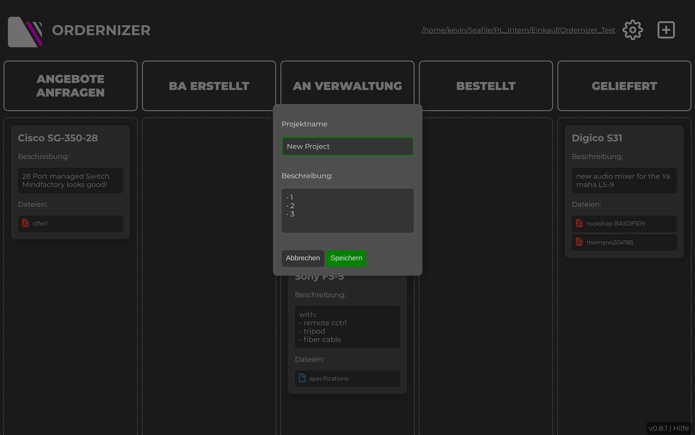

# Ordernizer

This is an app that helps to keep track of our orders at university

## Download

Go to the
[Release Page](https://github.com/kevinschweikert/Ordernizer/releases/)
and there you can download the latest build.

## Usage

### Start

- Click the gear icon to open the "open file" system dialog
- Select the folder with orders
- there has to be a file named ".ordernizer" otherwise you get an error message. This is to prevent, selecting the wrong folder
- if there are folders which were manually created, the app will aks you if you want to create a config in this folder. This is necessary, because all the informations are stored there
- The path is stored on your machine and will be used at the next start of the application. If you want to change the path, just select another path with the gear icon

### Add Project

Click the plus button in the upper right. A window will open and you have to type in a valid project name. It can't be empty and must only contain following letters: "A-Z", "a-z", "0-9" and "_". The description field is optional but advised. 

### Change Status

You can change the status of a card by dragging and dropping. The status is automatically written to the config file

### Edit Card

To edit a card, click on it. A window will appear where you can change the project name and its description. You have to save you changes with the "Speichern" button. When you click "Abbrechen or click outside the window, your changes will be discarded. If you click on "Ordner öffnen", your file browser will open the folder of the project. If you click at a file, your system will open this file with the corresponding application.

### Change Theme

Click on the logo or heading to toggle light and dark theme. The settig will be remebered even if you close the application.

## IDEAS

- add username field to track assigned person

## Screenshots

